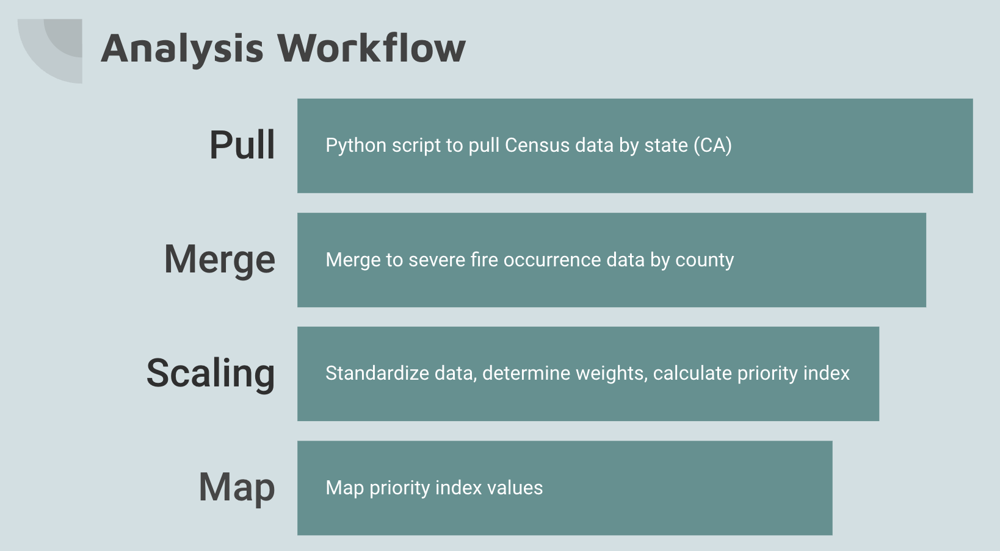

# Project: Prioritizing Forest Management Strategies using US Census Data

## Background
This project was part of the 2023 [Women in Data](https://www.womenindata.org/) Datathon, focused on the US Forest Service's Climate Risk Viewer and associated data. The Climate Risk Viewer includes data related to climate change vulnerabilities across the United States, including items such as watersheds, biodiversity, species at risk, forest characteristics, and firesheds.
## Problem statement
Determine which counties the US Forest Service should prioritize in their risk mitigation efforts.

## Stakeholders
The key stakeholders for this problem include the US Forest Service and their partners at the state and county levels.

## Data
We focused on fire-related data because we are seeing big impacts from wildfires related to climate change. Wildfires can quickly damage other elements of the ecosystems the Forest Service is working on protecting, so effectively managing fire risk can help make the Forest Service’s other conservation efforts more manageable as well. For this project, we used the Burn Severity Trends dataset, which tracks details about wildfires that covered more than 1,000 acres in the west and 500 acres elsewhere.

The Climate Risk Viewer includes a tremendous amount of data, but one element we didn’t see is how many people are in close proximity to the impacted regions. Since wildfires can spread and prompt measures like mass evacuations, we believe it’s important to take total nearby population into consideration when prioritizing fire prevention and mitigation efforts. In addition, the Forest Service’s efforts require funding and resources. Prioritizing projects based on number of people directly impacted could help more people advocate for this work, making it easier to generate support for continued funding. Therefore, we decided to join the wildfire data to county population data from the US Census Bureau's 2020 census.

## Workflow and code

We decided to focus on data for a single state to keep file sizes and processing times more manageable. We chose California because of its large population and large areas of high-risk firesheds in the Forest Service data. We used the Geopandas library to read in a shapefile of county boundaries from the US Census bureau and used the latitude and longitude coordinates from that file and the Burn Severity Trends dataset, which maps all fires greater than 1,000 acres in the West, to return county and state codes. There were a few entries missing county codes, so we used a Ball Tree nearest neighbors algorithm to fill in missing county values based on nearest known coordinates. 

The county and state codes enabled us to merge the burn severity trends with county population data from the 2020 census, so we could identify which areas in the burn severity data also had high resident populations. We normalized the data and specified weights of .6 for population and .4 for burn severity to calculate a priority index score for each county. A higher priority index score mean a county has a combination of high population and more severe fire occurrences. After calculating the priority index values, we visualized them in map form.

## Example

The map visually depicts the priority index score for each county in California. Counties with a higher index score have a combination of larger population and multiple indicents of severe wildfires, suggesting they are areas where mitigation efforts should be prioritized.

## How to use the repository
Run the state_filtering.py script with a state name as input, to pull map and population information for a given state.

# Data source and acknowledgements
- [Census Shapefile](https://catalog.data.gov/dataset/tiger-line-shapefile-2019-nation-u-s-current-county-and-equivalent-national-shapefile)
- 2020 Census Population Data, Demographic and Housing Characteristics: Retrieved from https://api.census.gov/data/
-[Monitoring Trends in Burn Severity Fire Occurrence Locations](https://data-usfs.hub.arcgis.com/datasets/usfs::monitoring-trends-in-burn-severity-fire-occurrence-locations-feature-layer/explore?location=35.752773%2C-115.615500%2C4.00&showTable=true): US Forest Service
-[USDA/Forest Service Climate Risk Viewer](https://storymaps.arcgis.com/collections/87744e6b06c74e82916b9b11da218d28?item=1)
